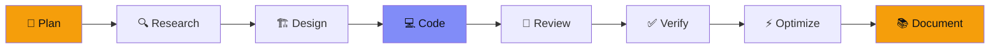

<div align="center">


<br/>

**An open-source, local-first autonomous AI software engineering agent — mobile-first by design, and fully portable across Android, Linux, Windows, and macOS.**

[](LICENSE)
[](pyproject.toml)
[](https://github.com/SHalimoosavi/syj-ai/actions)
[](#why)
[](CONTRIBUTING.md)
[](https://github.com/SHalimoosavi/syj-ai/stargazers)

<br/>


<sub>👆 Drop a terminal recording at <code>docs/assets/demo.gif</code> (try <a href="https://github.com/asciinema/agg">agg</a> or <a href="https://github.com/charmbracelet/vhs">vhs</a>) — this slot is already wired up.</sub>

</div>

---

## Table of Contents

- [Why SYJ AI](#why)
- [Features](#features)
- [How It Works](#how-it-works)
- [Requirements](#requirements)
- [Installation](#installation)
- [Usage](#usage)
- [Configuration](#configuration)
- [Architecture](#architecture)
- [Testing](#testing)
- [Troubleshooting](#troubleshooting)
- [Roadmap](#roadmap)
- [Contributing](#contributing)
- [License](#license)

---

## Why

<a name="why"></a>

Most AI coding agents assume a laptop, cloud credits, and always-on network access. **SYJ AI assumes none of that.**

It's built to act as a complete engineering team — architect, backend/frontend engineer, DevOps, security, QA, docs, and research — all driven by a single master system prompt, orchestrating two local models through [Ollama](https://ollama.com):

| Role | Model | Responsible for |
|---|---|---|
| 🧠 **Reasoning** | DeepSeek | Planning, research, debugging, architecture review |
| 💻 **Coding** | QwenCoder | Code generation, refactors, components, tests |

No API keys required. No data leaves your device by default. Fully usable offline, on-device — even from a phone.

---

## Features

<a name="features"></a>

<table>
<tr>
<td width="50%">

🔒 **Local-first**
Runs against Ollama on `localhost` — nothing phones home by default.

📴 **Offline-capable**
Zero internet required once models are pulled.

🧩 **Modular**
Swap models, add workflow stages, or add tools without touching the core.

🗂️ **Real files, not chat text**
Coding-stage output is parsed and written straight into a project workspace.

</td>
<td width="50%">

📱 **Mobile-ready**
Every dependency installs cleanly on Android via Termux, alongside full Linux/Windows/macOS support.

🛡️ **Safety-conscious**
Shell commands require explicit confirmation; filesystem access is sandboxed to the workspace.

☁️ **Optional remote fallback**
If Ollama is unreachable, gracefully falls back to a remote API — off by default.

✅ **Tested**
Ships with a pytest suite and CI covering the router, sandbox, and parser.

</td>
</tr>
</table>

---

## How It Works

<a name="how-it-works"></a>

Every task runs through a fixed, non-skippable workflow — nothing ships without verification:



Each stage is routed to the model best suited for it (reasoning vs. coding), and the **Code** stage writes real files directly into your workspace — sandboxed so nothing escapes the project directory.

---

## Requirements

<a name="requirements"></a>

- Python 3.9+
- [Ollama](https://ollama.com) installed and running (`ollama serve`)
- The coding and reasoning models, pulled locally:

  ```bash
  ollama pull qwen2.5-coder:7b
  ollama pull deepseek-r1:7b
  ```

---

## Installation

<a name="installation"></a>

<details open>
<summary><b>📱 Android (Termux)</b></summary>

```bash
pkg update && pkg install python git -y
git clone https://github.com/SHalimoosavi/syj-ai.git
cd syj-ai
pip install -e .
cp .env.example .env
```

</details>

<details>
<summary><b>🐧 Linux / macOS</b></summary>

```bash
git clone https://github.com/SHalimoosavi/syj-ai.git
cd syj-ai
python3 -m venv .venv && source .venv/bin/activate
pip install -e .
cp .env.example .env
```

</details>

<details>
<summary><b>🪟 Windows (PowerShell)</b></summary>

```powershell
git clone https://github.com/SHalimoosavi/syj-ai.git
cd syj-ai
python -m venv .venv; .\.venv\Scripts\Activate.ps1
pip install -e .
Copy-Item .env.example .env
```

</details>

<details>
<summary><b>🪟 Windows (CMD)</b></summary>

```cmd
git clone https://github.com/SHalimoosavi/syj-ai.git
cd syj-ai
python -m venv .venv && .venv\Scripts\activate.bat
pip install -e .
copy .env.example .env
```

</details>

---

## Usage

<a name="usage"></a>

**Check that Ollama and your models are reachable:**

```bash
syj doctor
```

**Run a full task through the engineering workflow:**

```bash
syj build "Build a FastAPI todo API with SQLite and JWT auth"
```

**Run only specific stages:**

```bash
syj build "Add rate limiting to the API" --stage plan,design,code
```

**Freeform chat, using the SYJ AI system prompt:**

```bash
syj chat
```

> Generated files land in `./syj_workspace` by default (configurable via `SYJ_WORKSPACE` in `.env`).

---

## Configuration

<a name="configuration"></a>

All configuration lives in `.env` — see [`.env.example`](.env.example) for the full list: workspace path, Ollama host, model names, timeouts, optional remote fallback, shell confirmation, and logging.

---

## Architecture

<a name="architecture"></a>

See [`docs/ARCHITECTURE.md`](docs/ARCHITECTURE.md) for the full breakdown of the package layout, the model router, the workflow engine, and the sandboxed tools.

---

## Testing

<a name="testing"></a>

```bash
pip install -e ".[dev]"
pytest -q
```

---

## Troubleshooting

<a name="troubleshooting"></a>

| Symptom | Cause | Fix |
|---|---|---|
| `syj doctor` reports Ollama unreachable | Ollama isn't running | `ollama serve` |
| A stage errors with `ModelBackendUnavailable` | Wanted model isn't pulled | `ollama pull <model>` |
| `WorkspaceEscapeError` | Model tried to write outside the workspace | Expected — the sandbox working correctly |
| `ShellPermissionDenied` | Command needs confirmation, or matches a destructive pattern | Re-run with explicit confirmation, or don't run it |

---

## Roadmap

<a name="roadmap"></a>

- [ ] Streaming responses in `syj chat` and `syj build`
- [ ] Pluggable tool registry (beyond filesystem/shell/git)
- [ ] Web dashboard as an alternative to the CLI
- [ ] Multi-file diff review before writing to the workspace

---

## Contributing

<a name="contributing"></a>

Issues and PRs are welcome. Keep changes modular, typed, and tested — see [`docs/ARCHITECTURE.md`](docs/ARCHITECTURE.md) and [`CONTRIBUTING.md`](CONTRIBUTING.md) before adding new stages or tools.

---

## License

<a name="license"></a>

[MIT](LICENSE) © Syed Ali Hasan Moosavi / SAYANJALI NEXUS PRIVATE LIMITED

<div align="center">
<sub>Built for engineers who ship from wherever they are.</sub>
</div>
