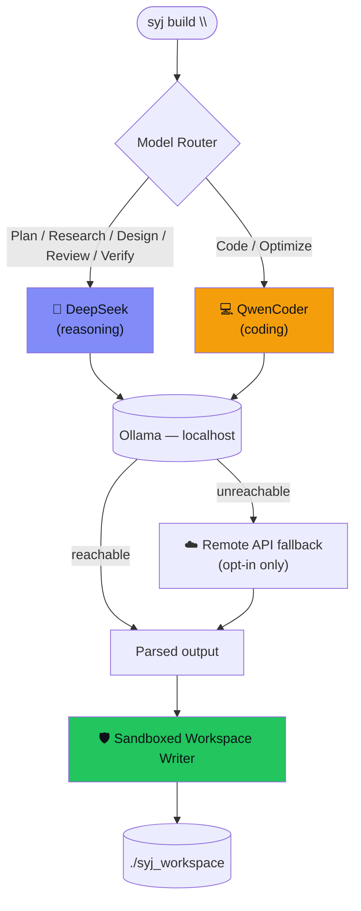
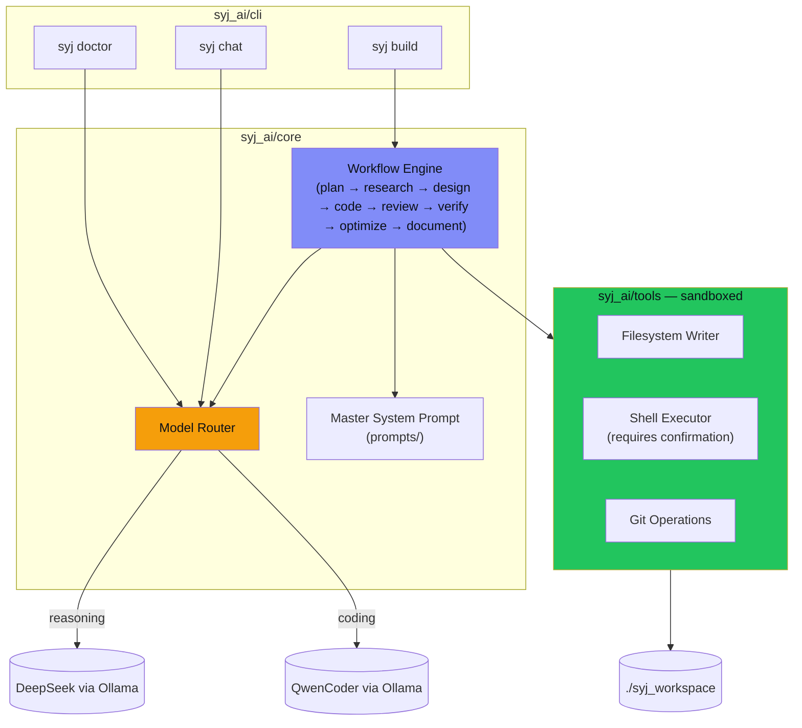

<div align="center">


<br/>

### Your engineering team, running entirely on your own hardware.

**An open-source, local-first autonomous AI software engineering agent — mobile-first by design, and fully portable across Android, Linux, Windows, and macOS.**

[](LICENSE)
[](pyproject.toml)
[](https://github.com/SHalimoosavi/syj-ai/actions)
[](#-why-syj-ai)
[](CONTRIBUTING.md)
[](https://github.com/SHalimoosavi/syj-ai/stargazers)

<br/>


<br/>

[Why SYJ AI](#-why-syj-ai) • [Features](#-features) • [How It Works](#-how-it-works) • [Installation](#-installation) • [Usage](#-usage) • [Architecture](#-architecture) • [Roadmap](#-roadmap)

</div>

---

## 📑 Table of Contents

- [Why SYJ AI](#-why-syj-ai)
- [Features](#-features)
- [How It Works](#-how-it-works)
- [Requirements](#-requirements)
- [Installation](#-installation)
- [Usage](#-usage)
- [Configuration](#-configuration)
- [Architecture](#-architecture)
- [Testing](#-testing)
- [Troubleshooting](#-troubleshooting)
- [Roadmap](#-roadmap)
- [Contributing](#-contributing)
- [License](#-license)

---

## 🤔 Why SYJ AI

Most AI coding agents assume a laptop, cloud credits, and always-on network access. **SYJ AI assumes none of that.**

It's built to act as a complete engineering team — architect, backend/frontend engineer, DevOps, security, QA, docs, and research — all driven by a single master system prompt, orchestrating two local models through [Ollama](https://ollama.com):

| Role | Model | Responsible for |
|---|---|---|
| 🧠 **Reasoning** | DeepSeek | Planning, research, debugging, architecture review |
| 💻 **Coding** | QwenCoder | Code generation, refactors, components, tests |

No API keys required. No data leaves your device by default. Fully usable offline, on-device — even from a phone.

---

## ✨ Features

**Runs anywhere, answers to no one**
- 🔒 **Local-first** — runs against Ollama on `localhost`; nothing phones home by default
- 📴 **Offline-capable** — zero internet required once models are pulled
- 📱 **Mobile-ready** — every dependency installs cleanly on Android via Termux, alongside full Linux/Windows/macOS support
- ☁️ **Optional remote fallback** — if Ollama is unreachable, gracefully falls back to a remote API — off by default

**Built like production software, not a demo**
- 🧩 **Modular** — swap models, add workflow stages, or add tools without touching the core
- 🗂️ **Real files, not chat text** — coding-stage output is parsed and written straight into a project workspace
- 🛡️ **Safety-conscious** — shell commands require explicit confirmation; filesystem access is sandboxed to the workspace
- ✅ **Tested** — ships with a pytest suite and CI covering the router, sandbox, and parser

---

## ⚙️ How It Works

Every task runs through a fixed, non-skippable workflow — nothing ships without verification:


Each stage is routed to the model best suited for it — reasoning vs. coding — and the **Code** stage writes real files directly into your workspace, sandboxed so nothing escapes the project directory.

### Model routing



---

## 📋 Requirements

| Requirement | Notes |
|---|---|
| **Python 3.9+** | Any platform: Android (Termux), Linux, macOS, Windows |
| **[Ollama](https://ollama.com)** | Installed and running (`ollama serve`) |
| **Local models** | Pulled ahead of time (see below) |

```bash
ollama pull qwen2.5-coder:7b
ollama pull deepseek-r1:7b
```

---

## 🚀 Installation

Pick the guide for your platform. Each one is copy-paste ready, start to finish.

<details open>
<summary><b>📱 Android (Termux)</b></summary>

```bash
# 1. Install prerequisites
pkg update && pkg install python git -y

# 2. Clone the repo
git clone https://github.com/SHalimoosavi/syj-ai.git
cd syj-ai

# 3. Install SYJ AI
pip install -e .

# 4. Set up your environment file
cp .env.example .env
```
</details>

<details>
<summary><b>🐧 Linux / macOS</b></summary>

```bash
# 1. Clone the repo
git clone https://github.com/SHalimoosavi/syj-ai.git
cd syj-ai

# 2. Create and activate a virtual environment
python3 -m venv .venv && source .venv/bin/activate

# 3. Install SYJ AI
pip install -e .

# 4. Set up your environment file
cp .env.example .env
```
</details>

<details>
<summary><b>🪟 Windows (PowerShell)</b></summary>

```powershell
# 1. Clone the repo
git clone https://github.com/SHalimoosavi/syj-ai.git
cd syj-ai

# 2. Create and activate a virtual environment
python -m venv .venv; .\.venv\Scripts\Activate.ps1

# 3. Install SYJ AI
pip install -e .

# 4. Set up your environment file
Copy-Item .env.example .env
```
</details>

<details>
<summary><b>🪟 Windows (CMD)</b></summary>

```cmd
:: 1. Clone the repo
git clone https://github.com/SHalimoosavi/syj-ai.git
cd syj-ai

:: 2. Create and activate a virtual environment
python -m venv .venv && .venv\Scripts\activate.bat

:: 3. Install SYJ AI
pip install -e .

:: 4. Set up your environment file
copy .env.example .env
```
</details>

### ✅ Verify your install

```bash
ollama serve &
syj doctor
```

If `syj doctor` reports both models reachable, you're ready to build.

---

## 💻 Usage

**Check that Ollama and your models are reachable:**

```bash
syj doctor
```

**Run a full task through the engineering workflow:**

```bash
syj build "Build a FastAPI todo API with SQLite and JWT auth"
```

**Run only specific stages:**

```bash
syj build "Add rate limiting to the API" --stage plan,design,code
```

**Freeform chat, using the SYJ AI system prompt:**

```bash
syj chat
```

> Generated files land in `./syj_workspace` by default (configurable via `SYJ_WORKSPACE` in `.env`).

---

## 🔧 Configuration

All configuration lives in `.env` — see [`.env.example`](.env.example) for the full list: workspace path, Ollama host, model names, timeouts, optional remote fallback, shell confirmation, and logging.

---

## 🏗️ Architecture

SYJ AI is organized around a router that dispatches each workflow stage to the right model, and a sandboxed tool layer that's the only thing allowed to touch your filesystem or shell.



See [`docs/ARCHITECTURE.md`](docs/ARCHITECTURE.md) for the full breakdown of the package layout, the model router, the workflow engine, and the sandboxed tools.

---

## 🧪 Testing

```bash
pip install -e ".[dev]"
pytest -q
```

CI runs this same suite on every push — see the badge at the top of this README for current status.

---

## 🛠️ Troubleshooting

| Symptom | Cause | Fix |
|---|---|---|
| `syj doctor` reports Ollama unreachable | Ollama isn't running | `ollama serve` |
| A stage errors with `ModelBackendUnavailable` | Wanted model isn't pulled | `ollama pull <model>` |
| `WorkspaceEscapeError` | Model tried to write outside the workspace | Expected — the sandbox is working correctly |
| `ShellPermissionDenied` | Command needs confirmation, or matches a destructive pattern | Re-run with explicit confirmation, or don't run it |

---

## 🗺️ Roadmap

- [ ] Streaming responses in `syj chat` and `syj build`
- [ ] Pluggable tool registry (beyond filesystem/shell/git)
- [ ] Web dashboard as an alternative to the CLI
- [ ] Multi-file diff review before writing to the workspace

---

## 🤝 Contributing

Issues and PRs are welcome. Keep changes modular, typed, and tested — see [`docs/ARCHITECTURE.md`](docs/ARCHITECTURE.md) and [`CONTRIBUTING.md`](CONTRIBUTING.md) before adding new stages or tools.

---

## 📜 License

[MIT](LICENSE) © Syed Ali Hasan Moosavi / SAYANJALI NEXUS PRIVATE LIMITED

<div align="center">

<sub>Built for engineers who ship from wherever they are.</sub>

**If SYJ AI is useful to you, consider ⭐ starring the repo.**

</div>
